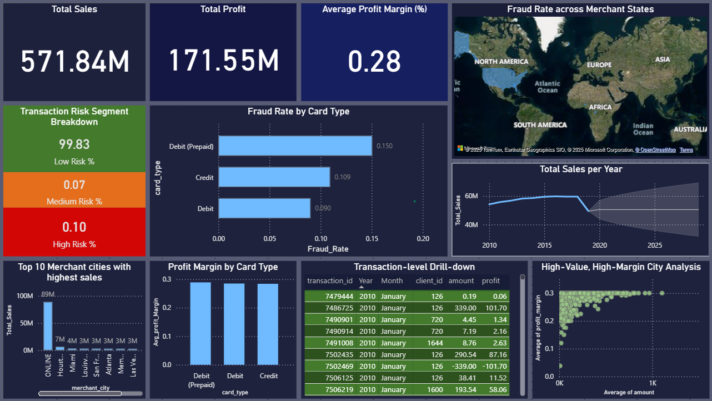

# Financial KPI Reporting with PySpark & Power BI

This project processes financial transaction data using **PySpark**, cleans and enriches it, and prepares a dataset for visualization in **Power BI**.  
It simulates missing amounts, calculates KPIs (cost, profit, profit margin), assigns risk segments, and outputs a clean CSV ready for business intelligence dashboards.


## Features
- Automated cleaning and enrichment of messy financial data.
- Simulates missing transaction amounts for realistic KPI calculations.
- Calculates KPIs: Total Sales, Profit, Profit Margin.
- Assigns transactions to risk segments (Low, Medium, High Risk).
- Prepares the dataset for Power BI visualization with a real-world business intelligence layout.
- Ready for GitHub as a Jupyter Notebook with Markdown documentation.

## Project Structure
```
├── Financial_KPI_Reporting.ipynb   # Main notebook
├── README.md                       # Project documentation
├── requirements.txt                # Python dependencies
└── Dashboard_demo                  # Power BI dashboard
```

## Installation & Setup
1. Clone this repository:
```bash
git clone https://github.com/yourusername/financial-kpi-reporting.git
cd financial-kpi-reporting
```

2. Create a virtual environment & install dependencies:
```bash
python -m venv venv
source venv/bin/activate   # On Windows: venv\Scripts\activate
pip install -r requirements.txt
```

3. Launch Jupyter Notebook:
```bash
jupyter notebook
```

## Usage
1. Open `Financial_KPI_Reporting_Cleaned_GitHub.ipynb`.
2. Follow the cells step-by-step to process and clean your data.
3. Export the final dataset and load it into Power BI for visualization.

## Power BI Dashboard
The prepared dataset can be visualized in Power BI to create a **Financial Performance & Risk Intelligence Dashboard**, featuring:
- KPI Cards: Total Sales, Profit, Avg Profit Margin, Fraud Rate
- Risk & Fraud Analysis
- Profitability & Business Drivers
- Sales Forecasting with What-If Analysis
- Transaction-Level Drilldown

## Technologies Used
- Python 3.x
- PySpark
- Pandas
- Jupyter Notebook
- Power BI

## License
This project is licensed under the MIT License - see the [LICENSE](LICENSE) file for details.
