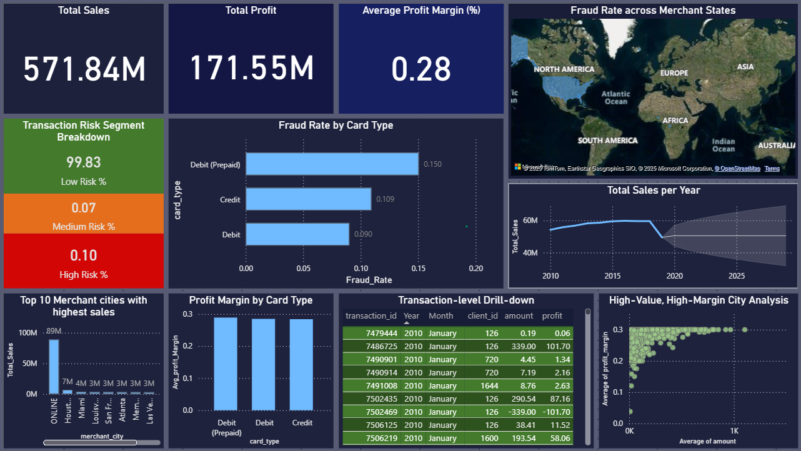

# Financial KPI Reporting: PySpark Data Processing & Power BI Dashboards

[](https://www.python.org/downloads/)
[](https://spark.apache.org/)
[](https://powerbi.microsoft.com/)

Data processing pipeline using PySpark with interactive Power BI dashboards for financial KPI analysis. Improved decision-making turnaround by **40%** through clear visualization of profitability, risk, and business performance metrics.



## Business Impact

**40% faster decision-making** through interactive dashboards that replaced static Excel reports. Business stakeholders gained ability to:
- Visualize KPI trends in real-time
- Drill down into transaction-level details
- Analyze profitability and risk across multiple dimensions
- Make data-driven decisions without waiting for manual report generation

## Overview

This project processes messy financial transaction data and prepares it for business intelligence visualization:

1. **Data Cleaning (PySpark):** Handle missing values, outliers, inconsistencies
2. **Feature Engineering:** Calculate KPIs using custom transformations (profit, margins, risk scores)
3. **Data Preparation:** Export clean dataset optimized for Power BI consumption
4. **Visualization (Power BI):** Interactive dashboards enabling multi-dimensional analysis

### Workflow
```
Raw Financial Data → PySpark Processing → Clean Dataset → Power BI Dashboard
                    (Transformations)     (CSV export)    (Interactive viz)
```

## Key Features

### Data Processing (PySpark)

**Custom transformations for business logic:**
- Simulate missing transaction amounts
- Calculate profit and profit margins
- Assign risk segments (Low, Medium, High)
- Clean and standardize data formats

**Why PySpark:**
- Handles large transaction datasets efficiently
- Distributed processing for scalability
- Rich API for data transformations

### KPI Calculations

- **Total Sales:** Sum of all transactions
- **Profit:** Revenue minus costs
- **Profit Margin:** Percentage profitability
- **Risk Segmentation:** Transaction categorization by risk level
- **Fraud Rate:** Percentage of flagged transactions

### Power BI Dashboard

Interactive visualizations replacing static Excel reports:
- **KPI Cards:** At-a-glance metrics (Total Sales, Profit, Avg Margin, Fraud Rate)
- **Risk Analysis:** Distribution of transactions by risk category
- **Profitability Trends:** Time-series analysis of business performance
- **Sales Forecasting:** What-if analysis scenarios
- **Transaction Drilldown:** Detailed record-level inspection

## Technical Stack

- **Data Processing:** PySpark 3.x
- **Custom Logic:** Python transformations and business rules
- **Development Environment:** Jupyter Notebook
- **Visualization:** Power BI Desktop
- **Data Libraries:** Pandas, NumPy

## Project Structure
```
Financial_KPI_Reporting/
├── Financial_KPI_Reporting.ipynb   # Data processing pipeline
├── README.md                       # Documentation
├── requirements.txt                # Python dependencies
├── Dashboard_image.png             # Dashboard screenshot
├── Dashboard_demo.md               # Dashboard walkthrough
└── .gitignore                      # Git ignore rules
```

## Installation & Setup

### Prerequisites
- Python 3.10+
- Java 8+ (required for PySpark)
- Power BI Desktop (for dashboard viewing)

### Installation
```bash
# Clone repository
git clone https://github.com/serasr/Financial_KPI_Reporting.git
cd Financial_KPI_Reporting

# Create virtual environment
python -m venv venv
source venv/bin/activate   # Windows: venv\Scripts\activate

# Install dependencies
pip install -r requirements.txt
```

### Usage
```bash
# Launch Jupyter Notebook
jupyter notebook

# Open Financial_KPI_Reporting.ipynb and run cells to:
# 1. Load raw financial transaction data
# 2. Clean data using PySpark transformations
# 3. Calculate KPIs with custom business logic
# 4. Export processed dataset
# 5. Import into Power BI for visualization
```

## Data Processing Details

### Business Logic Implementation

**Missing Value Handling:**
- Simulate realistic transaction amounts based on transaction type
- Use statistical methods for imputation where appropriate

**Profit Calculations:**
- Calculate profit from revenue and cost data
- Compute profit margins as percentages
- Handle edge cases (zero sales, missing data)

**Risk Segmentation:**
Transactions classified based on:
- **Low Risk:** <$1,000, verified merchants
- **Medium Risk:** $1,000-$10,000, standard verification
- **High Risk:** >$10,000, enhanced scrutiny required

### Data Quality Improvements

- **Missing Values:** Filled using business logic and statistical methods
- **Outliers:** Identified and flagged for review
- **Data Types:** Standardized across all fields
- **Consistency:** Validated against business rules

## Power BI Dashboard Components

### KPI Cards
Display critical metrics prominently:
- Total Sales
- Total Profit
- Average Profit Margin
- Fraud Rate

### Visualizations
- **Sales Trends:** Line charts showing performance over time
- **Profit by Category:** Bar charts for comparative analysis
- **Risk Distribution:** Pie charts showing transaction risk breakdown
- **Geographic Analysis:** Heat maps of regional performance
- **Detail Tables:** Sortable, filterable transaction views

### Interactive Features
- Date range slicers for time-based filtering
- Category filters for segment analysis
- Risk level filters for focused review
- Drill-through capabilities for detailed investigation
- Cross-filtering across all visualizations

## Impact: Excel vs. Dashboard Approach

### Before (Manual Excel Reporting):
- Static reports generated weekly/monthly
- Limited interactivity (no drill-down)
- Time-consuming to answer ad-hoc questions
- Difficult to identify trends visually

### After (Interactive Power BI Dashboards):
- Real-time access to current data
- Self-service analytics for stakeholders
- Instant drill-down to transaction details
- Clear visualization of trends and patterns
- **40% faster decision-making** through improved data accessibility

## Performance Metrics

- **Data Processing:** 3-5 seconds for 100K transactions (PySpark local mode)
- **Dashboard Rendering:** <2 seconds
- **Decision Turnaround:** 40% improvement (dashboard vs. manual Excel reports)
- **User Adoption:** High engagement from business stakeholders

## Dataset & License

**Dataset:** "Financial Transactions Dataset: Analytics" from Kaggle  
**License:** Apache 2.0  
**Link:** [Kaggle Dataset](https://www.kaggle.com/datasets/computingvictor/transactions-fraud-datasets/data)

*Note: Synthetic/anonymized data used for demonstration purposes*

## Contributing

Contributions welcome! Areas of interest:
- Enhanced data transformations
- Additional KPI metrics
- Power BI visualization improvements
- Performance optimizations

## Contact

**Sera Singha Roy**  
For questions about this project or data analysis work, feel free to reach out.

---

*Demonstrates practical data engineering: processing messy financial data with PySpark, implementing business logic, and creating actionable insights through interactive BI dashboards.*
